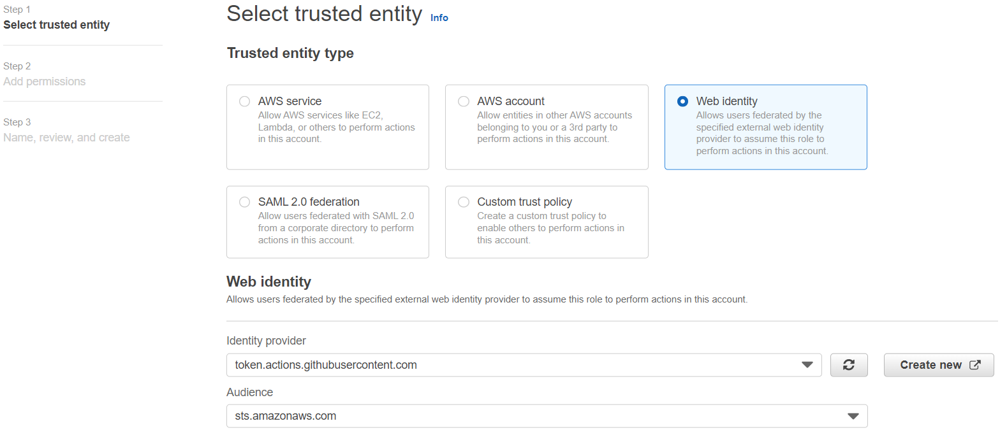

# Purpose
This repository details the differents steps needed to deploy our application iac on our AWS account.
We used the [innersourcing-ops-aws-bootstrap-infra](https://github.com/TotalEnergiesCode/innersourcing-ops-aws-bootstrap-infra) repository as a template to deploy our iac on our AWS account.

# Creation of OpenId connect role on AWS
[Digital Platform documentation](https://digitalplatforms.totalenergies.com/documentation/platforms/aws-platform/aws-lz-how-guides/how-iam#Which+identity+can+I+use+to+automate+my+GitHub+pipelines+)

To get started with this repository, you need to have :
- At least AWS workload account created
- In this AWS account, an IAM role created by hand for OIDC authentication between Github and AWS (note that the third party github application is already available):
 1. Name it like you want
 2. The trust relationships need to be like below with replacements
  - YOUR_ACCOUNT_ID: your AWS account id
  - YOUR_REPO_NAME: your github repository name like "TotalEnergiesCode/Project_name"

[]

```
{
    "Version": "2012-10-17",
    "Statement": [
        {
            "Effect": "Allow",
            "Principal": {
                "Federated": "arn:aws:iam::<account_id>:oidc-provider/token.actions.githubusercontent.com"
            },
            "Action": "sts:AssumeRoleWithWebIdentity",
            "Condition": {
                "StringEquals": {
                    "token.actions.githubusercontent.com:aud": "sts.amazonaws.com"
                },
                "StringLike": {
                    "token.actions.githubusercontent.com:sub": "repo:TotalEnergiesCode/aws-iac-pi2cloud:*"
                }
            }
        }
    ]
}
```

 3. Add permissions you need, just remember this role (and permissions you give it) will be assumed by your Github actions to deploy your infrastructure on AWS (here we used the owner role).

 4. Don't forget to add the permission boundary: ALZP-WL-PermissionsBoundary
It's mandatory for all your AWS IAM role

# Bootstrap terraform backend
To deploy our terraform backend we created an AWS S3 bucket to store the tf state and a dynamo db table to lock the configurations.
We updated the bootstrap workflow file (aws-iac-pi2cloud/.github/workflows/bootstrap.yaml) to add different environments (the differents secrets were added on the desired prod and dev environments: account id etc...).
That workflow needs an environement input and is manually launched from the action tab.
The workflows use a Cloud Formation Template to deploy the desired ressources, that file is located at aws-iac-pi2cloud/infrastructure/cloudformation/bootstrap/terraform-backend.cfn.yml
Once the backend is created we can start using our different workflows to deploy our application.
